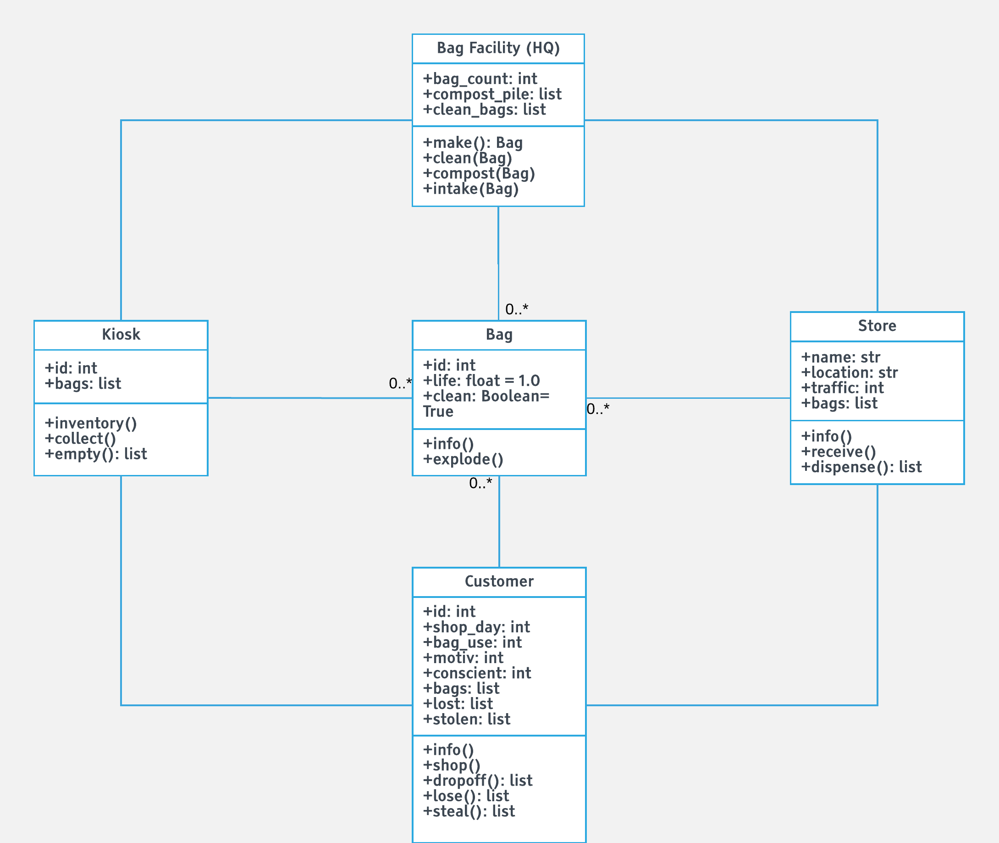

## Smart Orlando Reusable Bag System (*SmartORBS*) Code

While the problem at hand is complex and multifaceted, the current project focuses on one part of it, an automated system that manages reusable bag supplies across participating stores. The system comprises a central bag management facility (Bag HQ), bags, stores, return kiosks, and customers.

The automated system will detect how many bags are needed to meet customer demand, and will track inventory over time to determine how many new bags need to be produced to meet demand.

Additionally, the system will track the location of each bag throughout its life cycle, clean bags before redistributing them, and detect when bags need to be removed from circulation due to wear and tear.

The simulation will be run in [**BagBot**](smart_orbs/bagbot.py).

BagBot will take some initial information (e.g., a given number of customers, bags, stores, and kiosks) and simulate the exchange of bags as they interact with these components. First, the simulation can be adjusted to look at the outcome of varying customer populations, initial bag supplies, and buildings.

Given some other information that may need to be acquired through other experiments (e.g., using agent based simulation), such as customer decision making, the simulation can account for human behavior like loss or theft, as well as motivation due to mobile app use.

Currently, the main function in BagBot sets up the initial scenario to simulate. First, a set of customers is generated. For now, customers are randomly assigned attributes like preferred shopping day, number of bags used, motivation, and conscientiousness. Stores, kiosks, and a bag HQ, and an initial set of bags are also generated. 

After setting up the environment, the next step will be to have the system run through cycles of discrete time periods and to move the bags through the system, from bag HQ to store to customer to kiosk and back again. To add complexity, a delivery system can be added later to account for transportation of bags. Additionally, human attributes can be simulated more realistically to provide a more accurate depiction of customer behavior.

Each of the classes detailed below can be found in its own Python file with the beginning framework for each class:
* [**bag**](smart_orbs/bag.py) - biodegradable bags with a finite lifespan that need to be cleaned after use
* [**bagfacility**](smart_orbs/bagfacility.py) - headquarters for bag production, sorting, cleaning, composting, and distribution
* [**customer**](smart_orbs/customer.py) - human agent who interacts with the system by using bags and making decisions based on various internal and external factors
* [**kiosk**](smart_orbs/kiosk.py) - receptacle for returned bags that will be conveniently located to make it easier to return bags
* [**store**](smart_orbs.store.py) - grocery store that dispenses clean bags
 
Additional functions and attributes can be added to improve the simulation after initial testing.

