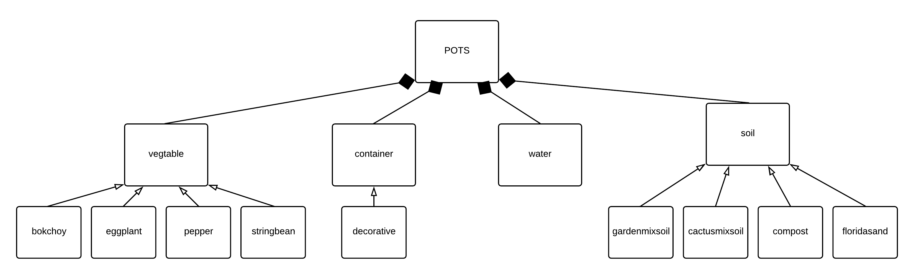
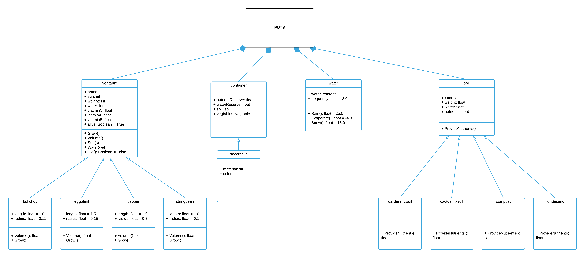

## **P**ortable **O**rganic **T**rouble-free **S**elf-watering System (**POTS**) Model

The POTS model includes components of a self-watering system. The classes defined are various types of vegetables, containers to hold them, water, and different types of soil.
(Remove: decribe the model here, use whatever diagram you need object, class, etc)

The simulation generates random vegetables and places them under variable conditions. The plants can either grow or die depending on variables like nutrients or water level.

Below is a high-level object diagram representing POTS.

Next is a more detailed class diagram for POTS:

The classes 'vegtable,' 'container,' and 'soil' have subclasses specifying different types of each. These subclasses interact with other components of the system to generate output, such as whether a plant lives or dies.