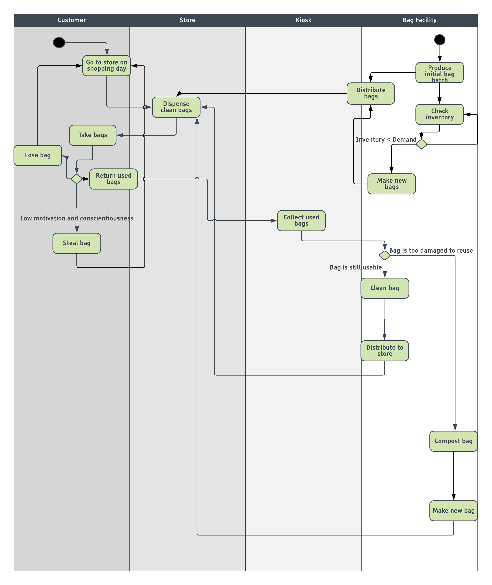

## Smart Orlando Reusable Bag System (SmartORBS) Model - Behavior Diagram

Below is an activity diagram demonstrating the processes involved in the bag inventory management system within SmartORBS.

The following components interact in the system:
* Customers who participate in the SmartORBS program
* Bags
* Stationary structures
  * Bag HQ
  * Store
  * Kiosk

If the system maintains accurate and up-to-date information on bag location and quantities, the system should run with a continuous supply of usable bags circulating across stores, kiosks, and customers.