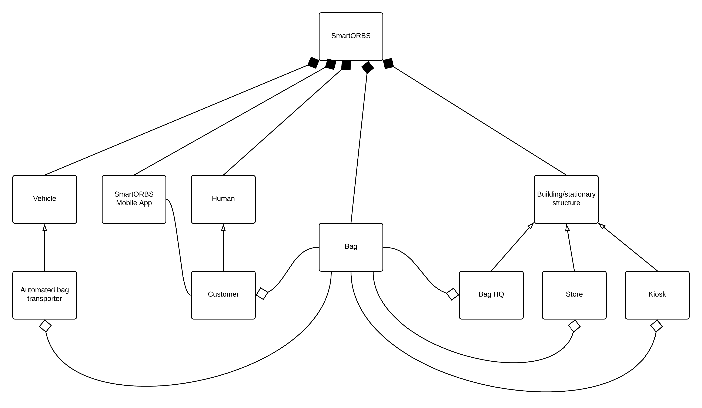

## Smart Orlando Reusable Bag System (SmartORBS) Model - Object Diagram

The automated bag management system, or Smart Orlando Reusable Bag System (SmartORBS) comprises several main components:
* Vehicles
  * Specifically, the system will use autonomous bag transporters
* SmartORBS Mobile App
* Humans
  * Customers who participate in the SmartORBS program are the main focus
* Bags
* Stationary structures
  * Bag HQ
  * Store
  * Kiosk

The entire system will involve an automated delivery system, a cleaning and composting system, an inventory tracking system, and a mobile app designed to motivate customers to participate in the program.